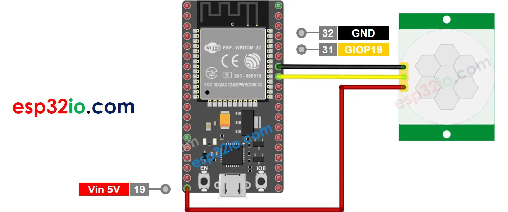

# Motion Sensor with ESP32

A simple code to use a motion sensor on ESP32.

At each detection, a webhook is sent to discord ; when the motion stop, another webhook is sent.
When the wifi connection is lost and then recovered, a webhook is sent with a "Connection lost for [n] seconds/minutes/hours" message.

## Wiring

### Materials

* ESP-WROOM-32 Dev Module
* Micro USB cable
* HC-SR501 Motion Sensor
* Jumper Wires female-female

### Wiring Diagram

  
  
More information <a href="https://esp32io.com/tutorials/esp32-motion-sensor">Here</a>

